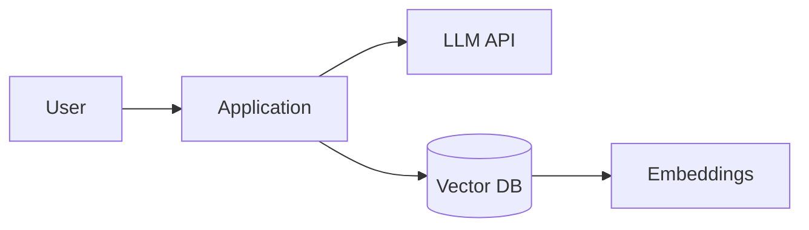

# AI Systems — Introduction

## Overview

AI systems engineering applies models—especially large language models (LLMs)—inside products with retrieval, tooling, evaluation, and safety guardrails. This section connects model basics to production patterns.

## Why This Exists

Shipping AI features requires more than prompt snippets: you need data pipelines, evaluation loops, latency/cost controls, and operational monitoring.

## How It Works

Progress through [LLM basics](llm_basics.md), [Embeddings](embeddings.md), [Vector databases](vector_databases.md), [RAG architecture](rag_architecture.md), [Prompt engineering](prompt_engineering.md), and [Production LLM systems](production_llm_systems.md).

## Architecture




## Key Concepts

<div class="topic-box">
<strong>Evaluation first</strong>
Define tasks, golden sets, and metrics before scaling complexity—otherwise you cannot tell if changes help.
</div>

## Code Examples

=== "Text — minimal RAG loop"

    ```text
    query -> embed -> retrieve top-k -> augment prompt -> generate -> cite sources
    ```

## Interview Questions

??? question "What is the biggest risk of naive RAG?"

    Retrieved noise or stale documents can override model priors—needs ranking, filtering, and evaluation on answer faithfulness.

??? question "How do you control cost for LLM features?"

    Cache embeddings, batch requests, choose smaller models for easy tasks, truncate context, and monitor tokens per request.

## Practice Problems

- Build a tiny RAG over your notes with citations  
- Create a rubric to grade hallucination rate on a fixed test set  

## Resources

- [Hugging Face Course](https://huggingface.co/learn)  
- [OpenAI Cookbook](https://cookbook.openai.com/)  
