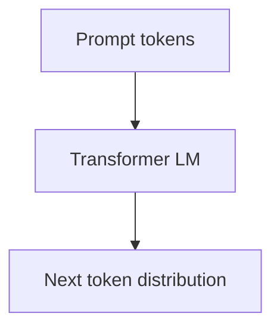

# LLM Basics

## Overview

Large language models predict the next token given prior context, trained on broad text corpora with self-supervised objectives. **Inference** samples or greedily picks tokens subject to temperature, top-k, and top-p.

## Why This Exists

LLMs generalize across tasks via prompting and fine-tuning, reducing bespoke model training for many product features.

## How It Works

Concepts: **tokenization**, **context windows**, **parameters vs inference compute**, **fine-tuning** vs **RLHF/DPO**, **hallucinations**, **calibration**, **latency** trade-offs across model sizes.

## Architecture




## Key Concepts

<div class="info-box">
<strong>Context limits</strong>
Long prompts increase cost and latency; retrieval and summarization compress relevant information into the window.
</div>

## Code Examples

=== "Python — OpenAI API sketch"

    ```python
    from openai import OpenAI

    client = OpenAI()
    resp = client.chat.completions.create(
        model="gpt-4.1-mini",
        messages=[{"role": "user", "content": "Explain TCP slow start in 3 bullets."}],
        temperature=0.2,
    )
    print(resp.choices[0].message.content)
    ```

## Interview Questions

??? question "What does temperature do?"

    Scales softmax logits—higher temperature increases randomness; lower makes outputs more deterministic.

??? question "Why do models hallucinate?"

    They optimize for plausible continuation, not grounded truth—unless constrained by retrieval, tools, or fine-tuning.

## Practice Problems

- Compare latency and quality for small vs large models on your task  
- Token-budget a prompt that includes system, tools, and user content  

## Resources

- [Attention Is All You Need](https://arxiv.org/abs/1706.03762)  
- [Stanford CS324 — LLMs](http://web.stanford.edu/class/cs324/)  
