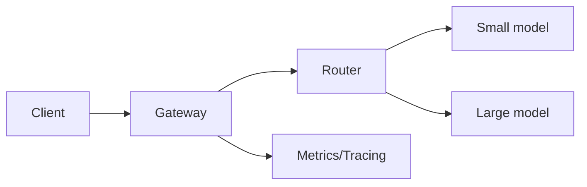

# Production LLM Systems

## Overview

Production LLM systems add **SLOs**, **observability**, **cost controls**, **safety**, **rollouts**, and **governance** around models. Reliability matters as much as prompt quality.

## Why This Exists

Prototypes break under load, bad outputs harm users, and spend can spiral without metering—engineering closes those gaps.

## How It Works

Operate **routing** across models, **caching** for repeated prompts, **streaming** responses, **rate limits**, **quotas**, **fallbacks**, **evaluation in CI**, **red teaming**, **logging** with PII controls, **A/B tests**, and **human review** queues.

## Architecture




## Key Concepts

<div class="topic-box">
<strong>Human in the loop</strong>
For high-risk domains, automatic generation is a draft—require review or confidence thresholds before actions with side effects.
</div>

## Code Examples

=== "Text — SLO examples"

    ```text
    95% of chat completions < 800ms p99 excluding model time
    Error rate < 0.1% on gateway
    Cost per successful task < $0.02
    ```

## Interview Questions

??? question "What should you log for LLM calls?"

    Request IDs, model version, latency, token usage, safety flags, and retrieval ids—not raw PII unless necessary and compliant.

??? question "How do you roll out a new prompt safely?"

    Shadow mode, canary traffic, offline evals, and automated regression checks on golden prompts.

## Practice Problems

- Add tracing from API gateway to vector retrieval to model call  
- Design a budget alert on daily token spend per tenant  

## Resources

- [Google SRE — monitoring](https://sre.google/sre-book/monitoring-distributed-systems/)  
- [NIST AI RMF](https://www.nist.gov/itl/ai-risk-management-framework)  
