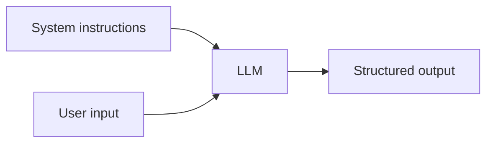

# Prompt Engineering

## Overview

Prompt engineering shapes model behavior with instructions, formats, examples, and constraints—without weight updates. It is the fastest iteration loop for product behavior.

## Why This Exists

Models are general; prompts specialize them. Clear structure reduces ambiguity and improves reliability for extraction, classification, and tools.

## How It Works

Patterns: **system vs user messages**, **few-shot examples**, **chain-of-thought** where appropriate, **JSON schema** outputs, **tool calling** schemas, **defense against injection** (treat untrusted text as data).

## Architecture




## Key Concepts

<div class="warning-box">
<strong>Prompt injection</strong>
Never trust user content to be passive data—separate instructions from data, filter, and sandbox tools.
</div>

## Code Examples

=== "XML-style delimiters (illustrative)"

    ```text
    <system>You are a careful assistant. Output JSON only.</system>
    <data>
      {{untrusted_user_content}}
    </data>
    <task>Summarize the data in 3 bullets.</task>
    ```

## Interview Questions

??? question "When are few-shot examples better than zero-shot?"

    When the desired format is niche or constraints are subtle—examples demonstrate the pattern faster than long prose.

??? question "How do you reduce variance across runs?"

    Lower temperature, constrain outputs, use schemas, and add self-consistency checks for critical tasks.

## Practice Problems

- Write a prompt that extracts structured resume fields into JSON  
- Harden a support bot prompt against prompt injection attempts  

## Resources

- [OpenAI prompt engineering guide](https://platform.openai.com/docs/guides/prompt-engineering)  
- [Anthropic prompt library](https://docs.anthropic.com/)  
