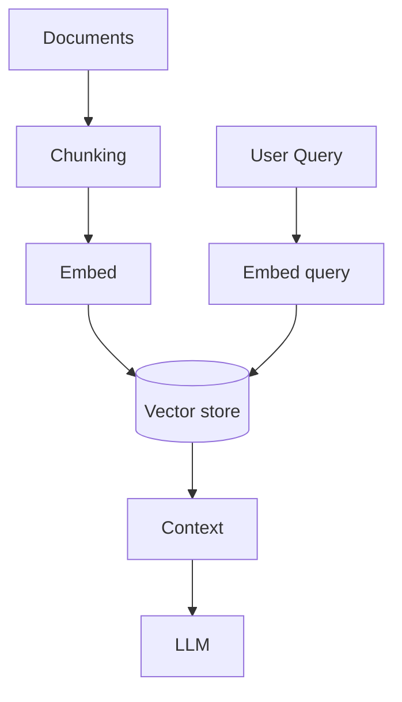

# RAG Architecture

## Overview

Retrieval-Augmented Generation (RAG) combines **retrieval** from a knowledge base with **generation** from an LLM, grounding answers in citations and reducing hallucinations when retrieval works well.

## Why This Exists

Models alone may lack private or up-to-date data; RAG injects relevant context per query without full fine-tunes for every fact.

## How It Works

Pipeline: **ingest** chunking, **embed**, **index**; **query** embed, **retrieve** top-k, **rerank** optionally, **prompt** with citations, **generate** answer. Add **guardrails**, **evals**, and **feedback** loops.

## Architecture




## Key Concepts

<div class="topic-box">
<strong>Chunking strategy</strong>
Too small loses context; too large dilutes relevance—experiment with headings, sliding windows, and structure-aware splits.
</div>

## Code Examples

=== "Text — prompt with citations requirement"

    ```text
    Answer using ONLY the provided passages. If insufficient, say you do not know.
    Passages:
    [1] ...
    [2] ...
    Question: ...
    ```

## Interview Questions

??? question "What is a common failure mode in RAG?"

    Retrieved chunks are irrelevant or contradictory; the model confidently merges them—needs better retrieval, reranking, or constraints.

??? question "How do you handle document updates?"

    Version chunks, re-embed changed sections, invalidate stale answers in UI, and track source timestamps.

## Practice Problems

- Add cross-encoder reranking to a baseline bi-encoder pipeline  
- Measure faithfulness with a labeled dataset of (question, context, answer)  

## Resources

- [LangChain RAG](https://python.langchain.com/docs/tutorials/rag/)  
- [LlamaIndex](https://docs.llamaindex.ai/)  
