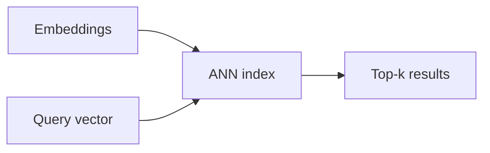

# Vector Databases

## Overview

Vector databases store embeddings and support **approximate nearest neighbor** (ANN) search at scale with filters (metadata), replication, and operational tooling.

## Why This Exists

Brute-force kNN is slow for millions of vectors; ANN indexes (HNSW, IVF, PQ) trade recall for speed.

## How It Works

Compare managed services (Pinecone, Weaviate Cloud, etc.) vs self-hosted (Milvus, Qdrant, pgvector). Understand **index types**, **recall/latency** trade-offs, **hybrid search** (keyword + vector), and **multi-tenant** isolation.

## Architecture




## Key Concepts

<div class="warning-box">
<strong>Filters first</strong>
Pre-filter metadata before ANN when selectivity is high—otherwise vector search wastes work on irrelevant partitions.
</div>

## Code Examples

=== "SQL — pgvector sketch"

    ```sql
    CREATE EXTENSION IF NOT EXISTS vector;

    CREATE TABLE docs (
      id bigserial PRIMARY KEY,
      body text,
      embedding vector(1536)
    );

    CREATE INDEX ON docs USING ivfflat (embedding vector_cosine_ops) WITH (lists = 100);
    ```

## Interview Questions

??? question "What is HNSW?"

    Hierarchical navigable small world graph for approximate nearest neighbors—fast queries with good recall on many workloads.

??? question "How do you update embeddings incrementally?"

    Upsert vectors with new versions, run background reindex jobs, and monitor recall after index parameter changes.

## Practice Problems

- Benchmark recall@k vs latency for your dataset and index settings  
- Design hybrid search combining BM25 and vector scores  

## Resources

- [FAISS documentation](https://faiss.ai/)  
- [pgvector](https://github.com/pgvector/pgvector)  
