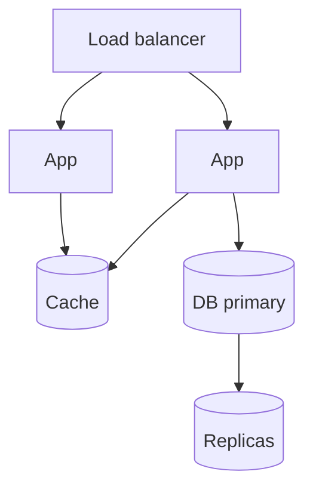

# API Scalability

## Overview

Scaling APIs means increasing sustainable throughput under latency SLOs. Levers include horizontal scaling, efficient data access, caching, async processing, and backpressure.

## Why This Exists

Traffic grows; incidents happen during peaks. Scalability work connects application design to infrastructure limits and cost.

## How It Works

Techniques: **stateless app servers**, **connection pooling**, **read scaling**, **partitioning**, **rate limiting**, **bulkheads**, **auto-scaling** policies, **load testing**, and **capacity planning**. Pair with [System design — scalability](../system_design/scalability.md).

## Architecture




## Key Concepts

<div class="topic-box">
<strong>Latency percentiles matter</strong>
Optimizing p99 often matters more than mean latency; trace tail events caused by GC, cold caches, or slow queries.
</div>

## Code Examples

=== "Go — server timeouts (illustrative)"

    ```go
    srv := &http.Server{
      Addr:              ":8080",
      ReadHeaderTimeout: 5 * time.Second,
      WriteTimeout:      10 * time.Second,
      IdleTimeout:       60 * time.Second,
    }
    ```

## Interview Questions

??? question "What is backpressure?"

    A mechanism to signal producers to slow down when consumers cannot keep up—essential to avoid unbounded queues and OOMs.

??? question "How does connection pooling help?"

    Reuses expensive TCP/TLS and DB handshakes; unbounded pools can exhaust DB resources—tune max connections per instance.

## Practice Problems

- Propose scaling plan for 10× traffic on a read-heavy catalog API  
- Identify bottlenecks in a flame graph showing DB time dominating requests  

## Resources

- [Google SRE — load balancing](https://sre.google/sre-book/load-balancing-frontend/)  
- [AWS Well-Architected — performance](https://docs.aws.amazon.com/wellarchitected/latest/performance-efficiency-pillar/welcome.html)  
