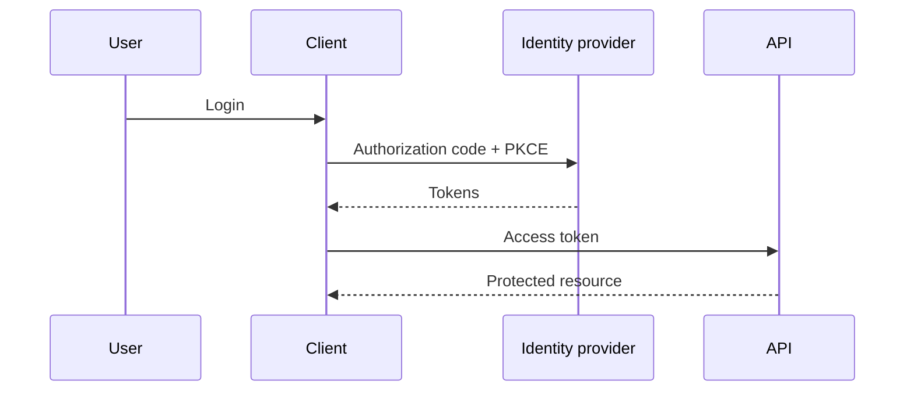

# Authentication

## Overview

Authentication establishes **who** is calling; authorization decides **what** they may do. Web APIs commonly use **sessions**, **API keys**, and **tokens** (often JWTs) with **OAuth2/OIDC** for delegated login.

## Why This Exists

Trust boundaries fail without strong identity. Password handling, token lifetimes, rotation, and revocation separate toy demos from production systems.

## How It Works

Study **password hashing** (Argon2/bcrypt), **MFA**, **OAuth2 flows** (authorization code with PKCE for SPAs), **JWT structure** (claims, signature, audience), **refresh tokens**, **revocation lists**, and **service-to-service** credentials (mTLS, workload identity).

## Architecture




## Key Concepts

<div class="warning-box">
<strong>JWTs are not a session store</strong>
They are signed blobs; if you need instant revocation or complex session state, pair tokens with server-side session tracking or short lifetimes + refresh.
</div>

## Code Examples

=== "Pseudocode — verify JWT claims"

    ```text
    verify_signature(token, jwks)
    assert iss == expected_issuer
    assert aud contains our_api
    assert exp > now
    check nbf if present
    ```

## Interview Questions

??? question "What is the difference between OAuth2 and OpenID Connect?"

    OAuth2 delegates authorization to access resources; OIDC adds identity tokens and standard userinfo on top of OAuth2.

??? question "Why use PKCE?"

    Prevents authorization code interception for public clients by binding the token exchange to a code verifier.

## Practice Problems

- Threat-model storing refresh tokens in mobile secure storage vs browser  
- Compare session cookies vs bearer tokens for same-site vs cross-site APIs  

## Resources

- [OAuth 2.0 Security BCP](https://datatracker.ietf.org/doc/html/draft-ietf-oauth-security-topics)  
- [OWASP Authentication Cheat Sheet](https://cheatsheetseries.owasp.org/cheatsheets/Authentication_Cheat_Sheet.html)  
