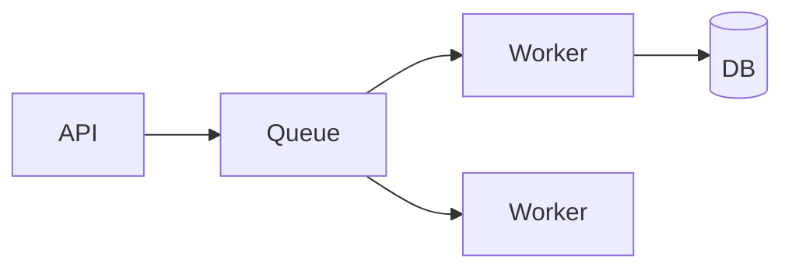

# Background Jobs

## Overview

Background jobs move work off the request path: emails, billing, analytics, image processing, and retries. Queues decouple producers and consumers and absorb bursts.

## Why This Exists

Users expect fast HTTP responses. Long-running or retry-heavy tasks belong in workers with supervision, idempotency, and dead-letter handling.

## How It Works

Study **message queues** (SQS, RabbitMQ, Kafka for event streams), **at-least-once** delivery, **idempotent consumers**, **visibility timeouts**, **priority queues**, **scheduled jobs** (cron + leader election), and **workflow engines** for multi-step processes.

## Architecture




## Key Concepts

<div class="warning-box">
<strong>Exactly-once is elusive</strong>
Aim for effective exactly-once via idempotent writes and deduplication keys rather than impossible distributed guarantees everywhere.
</div>

## Code Examples

=== "Pseudocode — idempotent job handler"

    ```text
    on message m:
      if already_processed(m.id): ack and return
      begin txn
        apply side effects
        record m.id as processed
      commit
      ack
    ```

## Interview Questions

??? question "What is a poison message?"

    A message that always fails processing; move to a dead-letter queue after retries for manual inspection.

??? question "How do you choose between a queue and a stream?"

    Queues for task distribution with competing consumers; streams/logs for replay, ordering partitions, and event sourcing patterns.

## Practice Problems

- Design retries for a payment webhook consumer calling an unreliable partner API  
- Compare Kafka partitions vs RabbitMQ queues for an analytics pipeline  

## Resources

- [AWS SQS developer guide](https://docs.aws.amazon.com/sqs/)  
- [Celery documentation](https://docs.celeryq.dev/) — Python workers  
