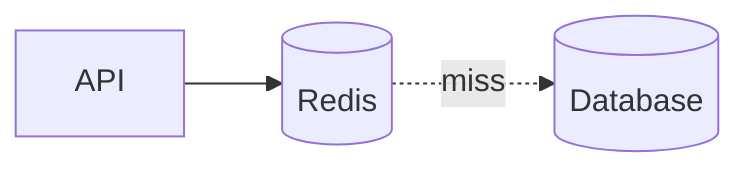

# Caching (Backend)

## Overview

Caching stores copies of expensive computations or remote reads closer to consumers—in-process, on servers, reverse proxies, CDNs, or dedicated stores like Redis.

## Why This Exists

Latency and load on databases dominate costs. Effective caching policies improve user experience until staleness or invalidation bugs appear—design carefully.

## How It Works

Patterns: **cache-aside**, **read-through**, **write-through**, **write-behind**. Concepts: **TTL**, **eviction**, **negative caching**, **singleflight**, **cache stampede** mitigation. For distributed caches, consider **consistent hashing** and **hot key** problems.

## Architecture




## Key Concepts

<div class="info-box">
<strong>Define freshness requirements</strong>
Every cached object needs an owner for invalidation and an acceptable staleness window tied to user-visible behavior.
</div>

## Code Examples

=== "Python — cache-aside sketch"

    ```python
    def get_user(user_id: str):
        key = f"user:{user_id}"
        hit = redis.get(key)
        if hit:
            return json.loads(hit)
        row = db.fetch_user(user_id)
        redis.setex(key, 300, json.dumps(row))  # 5m TTL
        return row
    ```

## Interview Questions

??? question "What is dogpile/stampede and how do you mitigate it?"

    Many processes recompute on expiry simultaneously—use locks, early refresh, or request coalescing.

??? question "When is write-through preferable?"

    When reads must be strongly consistent with writes and you can tolerate write latency to keep cache always warm.

## Practice Problems

- Choose TTL strategy for configuration vs user profile data  
- Design invalidation for nested aggregates displayed in a dashboard  

## Resources

- [Redis documentation](https://redis.io/docs/)  
- [Instagram engineering — caching](https://instagram-engineering.com/) — case studies in the wild  
