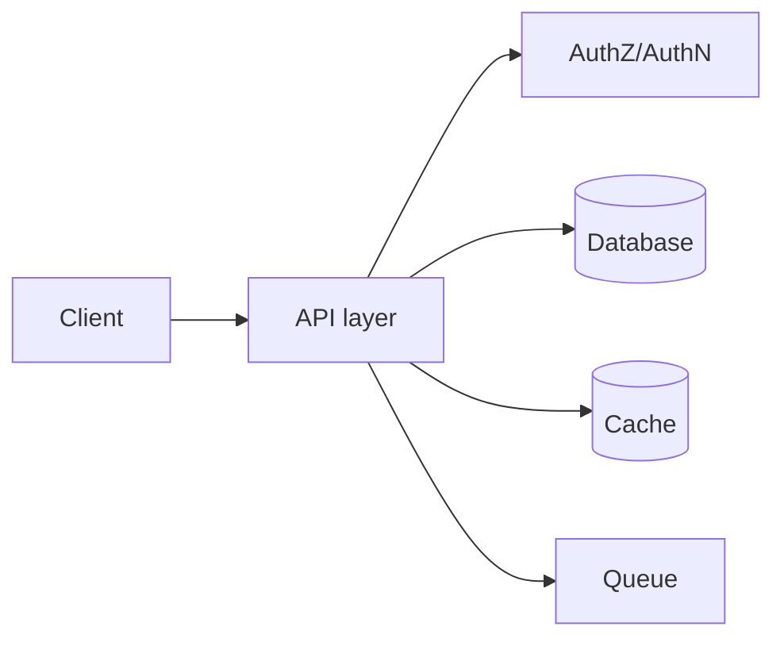

# Backend Engineering — Introduction

## Overview

Backend engineering turns business rules into reliable services: APIs that clients call, data that outlives requests, and operational properties like security, scalability, and observability.

## Why This Exists

Products depend on servers that compose databases, caches, queues, and third parties. This section aligns language-agnostic concepts you will see in every mature stack.

## How It Works

Topics include [REST API design](rest_api_design.md), [Authentication](authentication.md), [Microservices](microservices.md), [Caching](caching.md), [Background jobs](background_jobs.md), and [API scalability](api_scalability.md).

## Architecture




## Key Concepts

<div class="topic-box">
<strong>Operational mindset</strong>
Features ship; incidents teach. Design for logs, metrics, traces, safe deploys, and rollbacks from day one—not as an afterthought.
</div>

## Code Examples

=== "Text — request lifecycle checklist"

    ```text
    Authenticate -> Authorize -> Validate input -> Execute use case -> Persist -> Emit events -> Respond
    ```

## Interview Questions

??? question "What is the difference between authentication and authorization?"

    Authentication establishes identity; authorization decides whether that identity may perform an action on a resource.

??? question "Name three ways to scale a read-heavy API."

    Caching, read replicas, and materialized views or denormalized read models—each with consistency trade-offs.

## Practice Problems

- Sketch OpenAPI for a resource with pagination and filtering  
- Identify failure modes in a synchronous chain of three internal HTTP calls  

## Resources

- [Martin Fowler — microservices](https://martinfowler.com/microservices/)  
- [Google SRE Book](https://sre.google/sre-book/table-of-contents/)  
