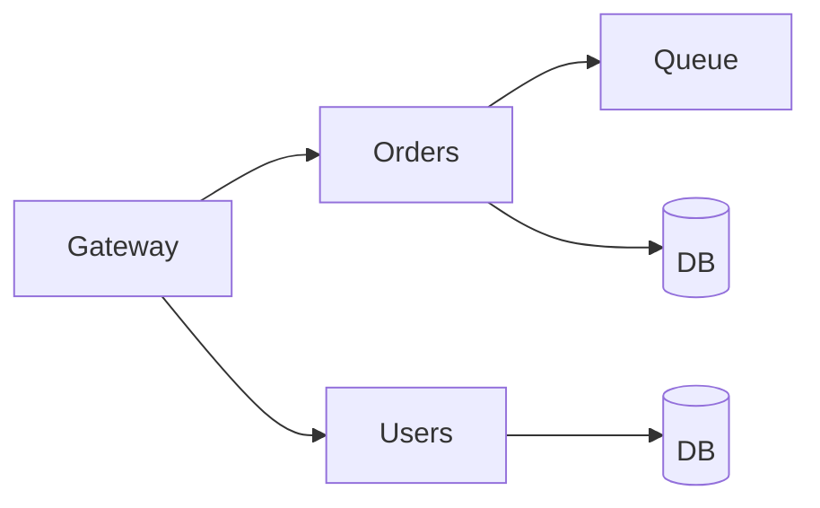

# Microservices

## Overview

Microservices split a system into independently deployable services owned by small teams. Benefits include scaling and isolation; costs include network chatter, distributed transactions, and operational complexity.

## Why This Exists

Monoliths are simpler early; microservices help when boundaries align with team structure, scaling profiles, or technology diversity—if you can afford the distributed systems tax.

## How It Works

Define **bounded contexts**, **API contracts**, **service discovery**, **resilience patterns** (timeouts, retries with jitter, bulkheads, circuit breakers), **observability**, and **data ownership** (avoid shared databases when possible).

## Architecture




## Key Concepts

<div class="topic-box">
<strong>Conway’s Law</strong>
Systems mirror teams; bad team boundaries become painful service boundaries—fix org alignment before carving services.
</div>

## Code Examples

=== "YAML — retry with exponential backoff (conceptual)"

    ```yaml
    retry:
      max_attempts: 5
      base_delay_ms: 50
      max_delay_ms: 2000
      jitter: full
    ```

## Interview Questions

??? question "What is a saga?"

    A sequence of local transactions with compensating actions to achieve a global outcome without a single distributed ACID transaction.

??? question "When is a monolith better?"

    Early product stages with unclear domains, small teams, and low operational maturity—optimize for iteration speed first.

## Practice Problems

- Identify data ownership boundaries for an e-commerce checkout flow  
- Compare synchronous HTTP chains vs events for notifying inventory  

## Resources

- [Building Microservices (Sam Newman)](https://samnewman.io/books/building_microservices_2nd_edition/)  
- [AWS — distributed systems patterns](https://docs.aws.amazon.com/prescriptive-guidance/latest/modern-application-development/appendix.html)  
