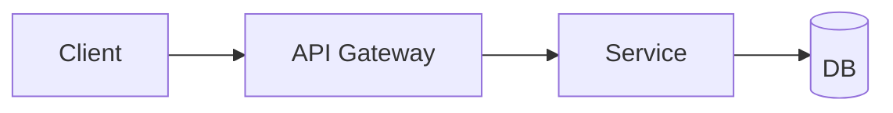

# REST API Design

## Overview

REST APIs model resources with HTTP methods and status codes. Good design balances predictable URLs, clear semantics, versioning, and error shapes that clients can program against.

## Why This Exists

Clients and multiple backend teams coordinate through HTTP contracts. Consistent patterns reduce integration bugs and speed onboarding.

## How It Works

Use **nouns for resources**, **nested routes sparingly**, **idempotent PUT/DELETE**, **pagination** (`cursor` preferred for large sets), **filtering**, **consistency in error payloads**, and explicit **versioning** (`/v1` or headers).

## Architecture




## Key Concepts

<div class="info-box">
<strong>HATEOAS (optional)</strong>
Hypermedia controls can guide clients, but many teams prefer stable JSON schemas plus OpenAPI documentation for practicality.
</div>

## Code Examples

=== "JSON — uniform error"

    ```json
    {
      "error": {
        "code": "invalid_argument",
        "message": "email must be a valid address",
        "details": [{ "field": "email", "description": "..." }]
      }
    }
    ```

=== "HTTP — pagination headers"

    ```http
    GET /v1/messages?cursor=abc&limit=50
    Link: </v1/messages?cursor=def&limit=50>; rel="next"
    ```

## Interview Questions

??? question "When would you use POST instead of PUT for updates?"

    When updates are partial, non-idempotent, or when the server assigns identifiers—though PATCH can be used for partial updates with explicit semantics.

??? question "How do you version APIs without breaking mobile clients?"

    Maintain compatibility windows, additive changes, feature flags, and optional fields—avoid removing or renaming fields without deprecation cycles.

## Practice Problems

- Write OpenAPI for CRUD on `projects` with team members as sub-resource  
- Compare cursor vs offset pagination for a high-volume feed  

## Resources

- [Microsoft REST API guidelines](https://github.com/microsoft/api-guidelines)  
- [OpenAPI Initiative](https://www.openapis.org/)  
