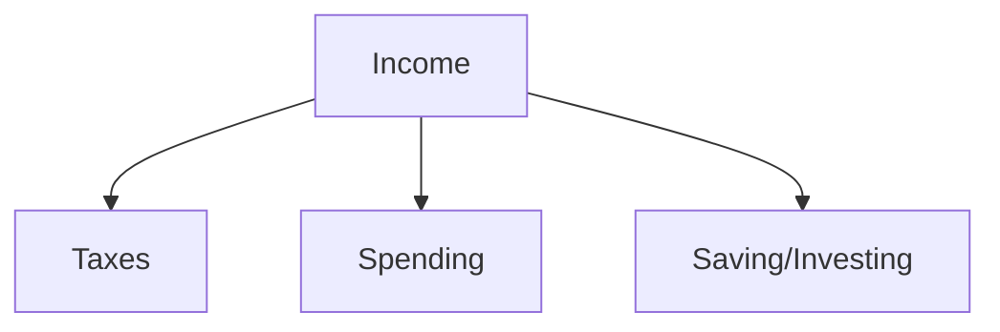

# Financial Literacy

## Overview

Financial literacy for engineers means budgeting with variable equity, understanding taxes at a high level, saving for goals, and avoiding common behavioral traps—not day-trading memes.

## Why This Exists

Compensation complexity increases with seniority; basic literacy reduces stress and supports long-term decisions.

## How It Works

Topics: **budgeting**, **emergency funds**, **retirement accounts** (locale-specific), **diversification**, **fees**, **inflation**, and **risk tolerance**. Separate investing education from career decisions.

## Architecture




## Key Concepts

<div class="info-box">
<strong>Personal finance is personal</strong>
Optimize for sleep-at-night money first—aggressive investing before an emergency fund is fragile.
</div>

## Code Examples

=== "Text — simple monthly plan skeleton"

    ```text
    Fixed costs: rent, utilities, insurance
    Variable: food, travel, hobbies
    Savings rate target: X% of net
    Retirement: automate contributions
    ```

## Interview Questions

??? question "Why diversify instead of picking stocks?"

    Reduces idiosyncratic risk; most individuals lack persistent edge—index funds are a common baseline.

??? question "What is lifestyle inflation?"

    Spending rises with income, eroding savings rate—watch it after promotions.

## Practice Problems

- Track spending for a month and categorize surprises  
- Read your pay stub and list pretax vs posttax deductions  

## Resources

- [Bogleheads wiki](https://www.bogleheads.org/wiki/Main_Page)  
- [Khan Academy — personal finance](https://www.khanacademy.org/college-careers-more/personal-finance)  
