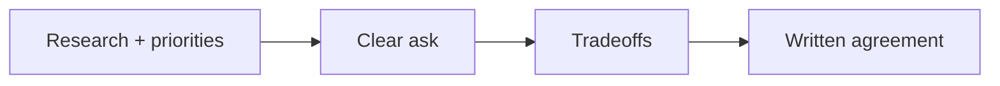

# Negotiation

## Overview

Negotiation aligns your offer with market value and personal constraints. The process works best with **data**, **professionalism**, and **clarity** on what you need to sign.

## Why This Exists

Offers are rarely final on first pass; recruiters expect structured negotiation within published bands.

## How It Works

Research benchmarks, prioritize levers (base vs equity vs signing bonus vs level), communicate in writing, and avoid ultimatums unless you mean them. Time-box decisions respectfully.

## Architecture




## Key Concepts

<div class="topic-box">
<strong>Negotiate with the decision-maker loop</strong>
Recruiters coordinate; hiring managers sometimes approve exceptions—understand who can say yes.
</div>

## Code Examples

=== "Text — example negotiation email skeleton"

    ```text
    Hi <name>,
    I'm excited about <team>. After reviewing the offer and market data for <level/location>,
    I was hoping we could explore <specific adjustment>. I’m flexible on structure and can discuss
    tradeoffs between base and equity. Could we schedule a short call this week?
    Thanks,
    <you>
    ```

## Interview Questions

??? question "Is it okay to disclose competing offers?"

    Share what you are comfortable with; focus on verifiable facts and avoid fabrications—integrity matters long-term.

??? question "What if they say the band is fixed?"

    Ask about signing bonus, relocation, level reconsideration, or start date flexibility—sometimes bands are softer than stated.

## Practice Problems

- Role-play negotiation with a peer playing recruiter  
- Write three polite counter scenarios with different priorities  

## Resources

- [Salary negotiation guide (Holloway)](https://www.holloway.com/g/negotiating-salary)  
- [Fearless Salary Negotiation](https://fearlesssalarynegotiation.com/) — book/site  
