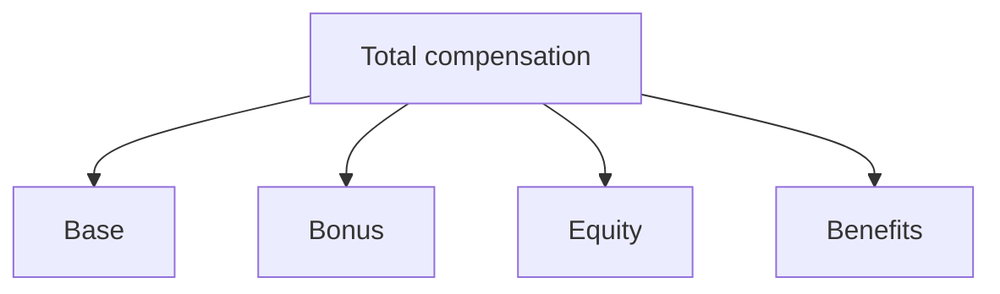

# Salary Structures

## Overview

Engineering compensation mixes **base salary**, **bonuses**, **equity**, and **benefits**. Structures vary by company stage, geography, and role level—benchmarks are directional, not guarantees.

## Why This Exists

Understanding components helps you compare offers fairly and plan cash flow, especially when equity is illiquid or volatile.

## How It Works

Public companies often emphasize RSUs; startups use stock options with strike prices and cliffs. Bonuses may be **target** percentages with performance multipliers. Benefits (401k match, insurance, stipends) matter to total comp.

## Architecture




## Key Concepts

<div class="warning-box">
<strong>Taxes and jurisdiction</strong>
Equity taxation is complex and locale-specific—consult a qualified professional for large decisions.
</div>

## Code Examples

=== "Text — offer comparison checklist"

    ```text
    - Base currency and payment cadence
    - Bonus: target %, performance criteria, guarantee period
    - Equity: type, vesting, cliff, refreshers, dilution risk
    - Benefits: health, retirement match, PTO, parental leave
    - Level and promotion cadence expectations
    ```

## Interview Questions

??? question "How do levels map across companies?"

    Roughly via scope and impact, but titles are not 1:1—use leveling guides and recruiter calibration.

??? question "What is a four-year vest with a one-year cliff?"

    No equity vests until 12 months; then typically monthly—read your grant documents carefully.

## Practice Problems

- Build a spreadsheet modeling two offers with different equity volatility assumptions  
- List questions to ask HR about refresh grants and promotion equity bumps  

## Resources

- [Levels.fyi](https://www.levels.fyi/) — crowdsourced compensation  
- [Glassdoor](https://www.glassdoor.com/) — qualitative signals  
