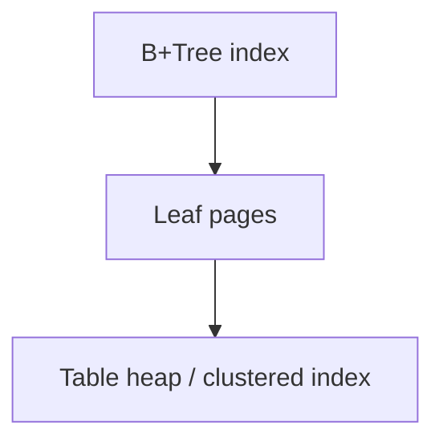

# Indexing

## Overview

Indexes accelerate lookups by maintaining auxiliary structures (often B-trees or hash tables) that map key values to row locations. They are the primary tool for turning full scans into selective seeks.

## Why This Exists

Tables grow; scanning every row for each query does not scale. Indexes trade extra storage and slower writes for faster reads on hot access paths.

## How It Works

Study **B-tree/B+tree** indexes for range queries, **hash** indexes for equality, and **composite** indexes where column order matters. Learn **covering indexes** (INCLUDE columns) and why **selectivity** drives usefulness.

## Architecture




## Key Concepts

<div class="topic-box">
<strong>Leftmost prefix rule</strong>
For composite `(a, b, c)`, queries filtering only on `b` may not use the index efficiently—column order encodes sortability.
</div>

## Code Examples

=== "SQL — composite index"

    ```sql
    CREATE INDEX idx_orders_user_created
      ON orders (user_id, created_at DESC);

    -- Likely index-friendly
    SELECT * FROM orders
    WHERE user_id = 123
    ORDER BY created_at DESC
    LIMIT 20;
    ```

## Interview Questions

??? question "Why can too many indexes hurt write performance?"

    Each insert/update/delete must maintain every affected index structure, increasing I/O and lock contention.

??? question "What is index-only scan?"

    When all selected columns exist in the index, the engine may avoid visiting the heap/clustered table.

## Practice Problems

- Design indexes for a timeline query with pagination by `(user_id, id)`  
- Compare sequential scan vs index scan using `EXPLAIN` on growing data  

## Resources

- [Use The Index, Luke](https://use-the-index-luke.com/)  
- [CMU 15-445 — indexing lectures](https://15445.courses.cs.cmu.edu/)  
