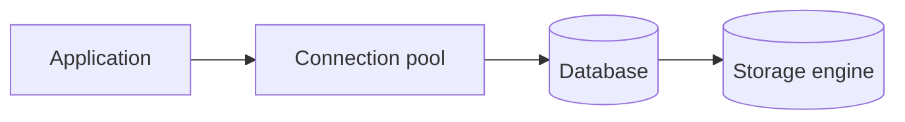

# Databases — Introduction

## Overview

Databases manage durable, shared state with defined consistency and query semantics. This section connects relational theory to engines, indexes, transactions, and scaling strategies used in production.

## Why This Exists

Almost every backend persists data. Interviews and design discussions assume you can reason about schemas, isolation, failure modes, and how to scale reads and writes safely.

## How It Works

Progress from relational modeling and SQL ([SQL basics](sql_basics.md), [Joins](joins.md)) to physical storage ([Indexing](indexing.md)), correctness under concurrency ([Transactions](transactions.md)), performance tuning ([Query optimization](query_optimization.md)), and growth patterns ([Scaling databases](scaling_databases.md)).

## Architecture




## Key Concepts

<div class="topic-box">
<strong>Logical vs physical</strong>
SQL describes a logical result; the planner chooses indexes and join algorithms to approximate that result efficiently.
</div>

## Code Examples

=== "SQL — create table and index"

    ```sql
    CREATE TABLE users (
      id BIGSERIAL PRIMARY KEY,
      email TEXT NOT NULL UNIQUE,
      created_at TIMESTAMPTZ NOT NULL DEFAULT now()
    );

    CREATE INDEX idx_users_created_at ON users (created_at DESC);
    ```

## Interview Questions

??? question "What problems do databases solve that files on disk do not?"

    Concurrent access, transactional semantics, indexing for fast lookup, declarative querying, and operational tooling (backups, replication).

??? question "When would you choose SQL vs a document store?"

    Prefer SQL when you need joins, constraints, and mature transactional semantics; consider documents for flexible schema and nested aggregates when access patterns match.

## Practice Problems

- Design a schema for a multi-tenant SaaS with strong tenant isolation  
- Given slow queries, walk through reading an `EXPLAIN` plan and proposing indexes  

## Resources

- [Use The Index, Luke!](https://use-the-index-luke.com/) — practical indexing guide  
- [PostgreSQL Documentation](https://www.postgresql.org/docs/) — reference implementation details  
