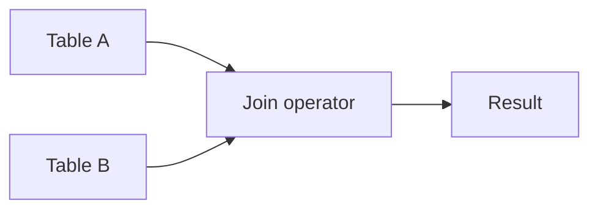

# Joins

## Overview

Joins combine rows from two or more tables according to predicates. They are central to relational modeling and to query plans that dominate application latency at scale.

## Why This Exists

Normalized schemas split entities across tables; joins reconstruct the relationships at query time. Understanding join types prevents silent data loss and cartesian explosions.

## How It Works

Know **INNER**, **LEFT**, **RIGHT**, **FULL** joins and when each preserves non-matching rows. Study **equi-joins** vs **non-equi** joins and **semi-joins** (`EXISTS`, `IN`). At execution, planners may choose nested loop, hash join, or merge join.

## Architecture




## Key Concepts

<div class="warning-box">
<strong>Cartesian products</strong>
Missing join conditions or overly broad predicates can explode row counts—watch for accidental cross joins.
</div>

## Code Examples

=== "SQL — inner vs left"

    ```sql
    -- Inner: only matching pairs
    SELECT u.email, o.id
    FROM users u
    INNER JOIN orders o ON o.user_id = u.id;

    -- Left: all users, orders optional
    SELECT u.email, o.id
    FROM users u
    LEFT JOIN orders o ON o.user_id = u.id;
    ```

## Interview Questions

??? question "How does a hash join work?"

    Build a hash table on the smaller input (often), probe with the larger; efficient for equi-joins when memory allows.

??? question "When is nested loop join preferred?"

    Small inputs, selective indexes, or when one side is tiny—O(n·m) worst case but great with strong selectivity.

## Practice Problems

- Given two tables, write queries for “users without orders” and “orders with user details”  
- Analyze a slow join using `EXPLAIN (ANALYZE, BUFFERS)` in PostgreSQL  

## Resources

- [Use The Index, Luke — joins](https://use-the-index-luke.com/sql/join)  
- [MySQL JOIN optimization](https://dev.mysql.com/doc/refman/8.0/en/optimization.html) — planner concepts transfer broadly  
