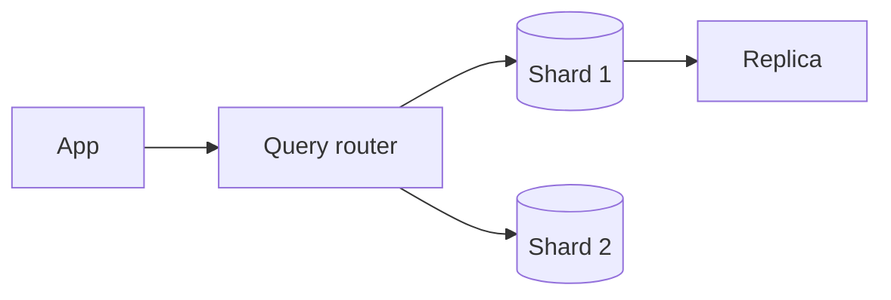

# Scaling Databases

## Overview

Scaling databases means increasing read/write throughput and storage without sacrificing correctness goals. Common strategies include replication, partitioning, caching, and choosing specialized engines.

## Why This Exists

Single-node databases hit vertical limits. Teams shard data, add replicas, and introduce caches—each choice shifts failure modes and consistency guarantees.

## How It Works

Study **primary/replica** replication, **synchronous vs asynchronous**, **failover**, **partitioning/sharding** keys, **hot spots**, **read-after-write consistency**, and **global distribution** trade-offs. Pair with [System design — database scaling](../system_design/database_scaling.md).

## Architecture




## Key Concepts

<div class="topic-box">
<strong>Shard key selection</strong>
Poor keys create uneven partitions and undo scale benefits; often combine user id with time bucketing for telemetry workloads.
</div>

## Code Examples

=== "Conceptual — routing pseudocode"

    ```python
    def shard_for_tenant(tenant_id: int, num_shards: int) -> int:
        return hash(tenant_id) % num_shards
    ```

## Interview Questions

??? question "How does leader-follower replication handle failures?"

    Promote a replica with bounded data loss depending on sync policy; split-brain risks require quorum/fencing.

??? question "What is a thundering herd on cache expiry?"

    Many requests miss cache simultaneously; mitigate with probabilistic early expiry, singleflight, or request coalescing.

## Practice Problems

- Design a sharding scheme for multi-tenant SaaS with per-tenant isolation  
- Compare read replicas vs caching for a read-heavy profile feed  

## Resources

- [Designing Data-Intensive Applications — replication and partitioning](https://dataintensive.net/)  
- [AWS Database Blog](https://aws.amazon.com/blogs/database/) — operational patterns  
