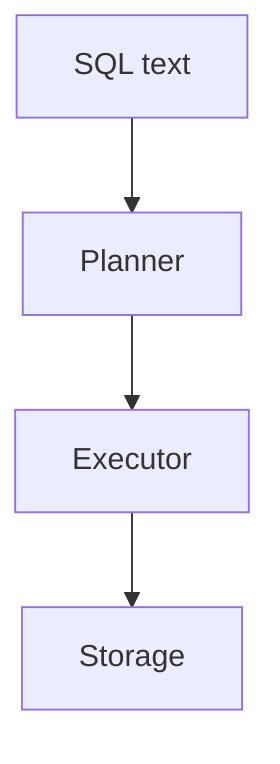

# SQL Basics

## Overview

SQL is the lingua franca of relational databases: you declare schemas with DDL, mutate rows with DML, and query with a declarative SELECT. Fluency in core syntax and set thinking unlocks debugging and modeling discussions.

## Why This Exists

Backends persist entities and relationships; SQL expresses constraints and queries that ORMs eventually translate. Reading and writing SQL remains essential even when abstractions hide details.

## How It Works

Master **SELECT** projection, **WHERE** filtering, **GROUP BY** aggregation, **HAVING** on aggregates, **ORDER BY** sorting, and **LIMIT/OFFSET** pagination. Understand **keys**, **constraints**, and **NULL** semantics.

## Architecture




## Key Concepts

<div class="info-box">
<strong>Set-oriented thinking</strong>
Avoid row-by-row mental models unless necessary; prefer joins and aggregates that let the engine optimize.
</div>

## Code Examples

=== "SQL — aggregation"

    ```sql
    SELECT u.id, COUNT(o.id) AS order_count
    FROM users u
    LEFT JOIN orders o ON o.user_id = u.id
    GROUP BY u.id
    HAVING COUNT(o.id) >= 5
    ORDER BY order_count DESC;
    ```

=== "SQL — upsert pattern"

    ```sql
    INSERT INTO inventory (sku, qty)
    VALUES ('ABC', 10)
    ON CONFLICT (sku) DO UPDATE
      SET qty = inventory.qty + EXCLUDED.qty;
    ```

## Interview Questions

??? question "What is the difference between WHERE and HAVING?"

    WHERE filters rows before grouping; HAVING filters groups after aggregation.

??? question "Explain NULL behavior in comparisons."

    Comparisons with NULL yield UNKNOWN in three-valued logic; use IS NULL/IS NOT NULL and COALESCE/NULLIF carefully.

## Practice Problems

- LeetCode Database problems (aggregations and joins)  
- Schema a blog with posts, tags, and comments in 3NF  

## Resources

- [SQLBolt](https://sqlbolt.com/) — interactive lessons  
- [PostgreSQL SELECT tutorial](https://www.postgresql.org/docs/current/sql-select.html)  
