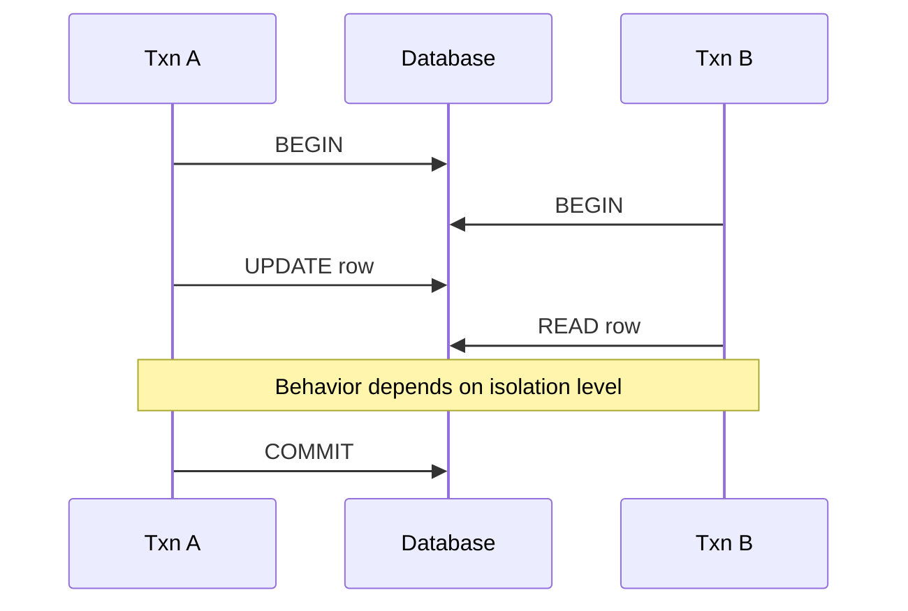

# Transactions

## Overview

Transactions group operations into atomic units with **ACID** properties. Isolation levels define which anomalies may appear when transactions run concurrently.

## Why This Exists

Concurrent backends would corrupt data without clear rules for interleaving reads and writes. Transactions are the contract between application expectations and engine behavior.

## How It Works

Understand **BEGIN/COMMIT/ROLLBACK**, **durability** via WAL, and isolation levels: **Read Uncommitted**, **Read Committed**, **Repeatable Read**, **Serializable**. Learn **lost update**, **dirty read**, **non-repeatable read**, **phantom read**, and how engines mitigate them (MVCC, locking).

## Architecture




## Key Concepts

<div class="info-box">
<strong>MVCC snapshot</strong>
Many systems implement repeatable reads by showing a transaction a consistent snapshot of rows as of start time, using row versions rather than long read locks.
</div>

## Code Examples

=== "SQL — explicit transaction"

    ```sql
    BEGIN;
    UPDATE accounts SET balance = balance - 100 WHERE id = 1;
    UPDATE accounts SET balance = balance + 100 WHERE id = 2;
    COMMIT;
    ```

## Interview Questions

??? question "What is two-phase locking (2PL)?"

    Growing phase acquires locks; shrinking phase releases—used to achieve serializability in classical theory; practical systems mix with MVCC.

??? question "Give an example of a write skew anomaly."

    Two transactions read overlapping sets of rows and make decisions based on counts that become invalid after both commit—may require serializable isolation or explicit constraints.

## Practice Problems

- Implement idempotent payment processing with unique idempotency keys  
- Explain how your database’s default isolation maps to anomalies you have seen in logs  

## Resources

- [PostgreSQL isolation](https://www.postgresql.org/docs/current/transaction-iso.html)  
- [Designing Data-Intensive Applications — transactions](https://dataintensive.net/)  
