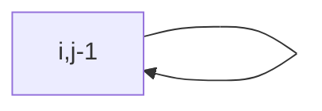

# Dynamic Programming

## Overview

Dynamic programming (DP) solves optimization and counting problems by **memoizing** overlapping subproblems or building **iterative** tables along a clear state order. It is one of the most interview-relevant paradigms after arrays and graphs.

## Why This Exists

Brute-force recursion often revisits the same states exponentially. DP collapses that redundancy by storing results of subproblems with well-defined dependencies.

## How It Works

Steps: identify **state**, **transition**, **base cases**, and whether the order is **top-down** (memoization) or **bottom-up** (tabulation). Common families include **knapsack**, **LCS/LIS**, **interval DP**, **grid paths**, and **digit DP**.

## Architecture




## Key Concepts

<div class="topic-box">
<strong>Optimal substructure</strong>
The optimal answer for the whole problem can be built from optimal answers to subproblems—verify the property before applying DP.
</div>

## Code Examples

=== "Python — top-down Fibonacci with memo"

    ```python
    from functools import lru_cache

    @lru_cache(maxsize=None)
    def fib(n: int) -> int:
        if n <= 1:
            return n
        return fib(n - 1) + fib(n - 2)
    ```

=== "Python — bottom-up coin change (min coins)"

    ```python
    def coin_change(coins: list[int], amount: int) -> int:
        inf = amount + 1
        dp = [0] + [inf] * amount
        for x in range(1, amount + 1):
            for c in coins:
                if c <= x:
                    dp[x] = min(dp[x], dp[x - c] + 1)
        return dp[amount] if dp[amount] != inf else -1
    ```

## Interview Questions

??? question "What is the difference between greedy and DP?"

    Greedy makes locally optimal choices without revisiting; DP is needed when local choices conflict and overlapping subproblems require memoization or tabulation.

??? question "How do you reduce space for grid DP?"

    If transitions only need the previous row, keep two rows or even one row sliding over columns.

## Practice Problems

- LeetCode 322 — Coin Change  
- LeetCode 1143 — Longest Common Subsequence  
- LeetCode 312 — Burst Balloons (interval DP)  

## Resources

- [DP Patterns (leetcode discuss)](https://leetcode.com/discuss/general-discussion/458695/Dynamic-Programming-Patterns) — community pattern map  
- [Algorithms (Erickson) — DP](http://jeffe.cs.illinois.edu/teaching/algorithms/) — free book chapters  
