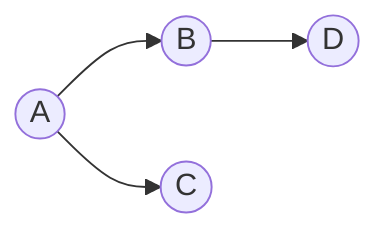

# Graphs

## Overview

Graphs model relationships: vertices and edges, directed or undirected, weighted or unweighted. They are the backbone of networks, dependencies, maps, and state spaces.

## Why This Exists

Many real systems are graphs—social networks, package dependencies, routing tables. Interview problems often reduce to DFS/BFS, topological sorting, shortest paths, or union-find.

## How It Works

Representations include **adjacency lists** (common), **adjacency matrices** (dense graphs), and **edge lists**. Master **BFS** for shortest path in unweighted graphs, **Dijkstra** for non-negative weights, **Bellman–Ford** when edges can be negative, and **topological sort** for DAGs.

## Architecture




## Key Concepts

<div class="warning-box">
<strong>State space graphs</strong>
Many “board” or “string transformation” puzzles are implicit graphs—nodes are states, edges are valid moves.
</div>

## Code Examples

=== "Python — adjacency list DFS"

    ```python
    def dfs(graph: dict[int, list[int]], start: int) -> set[int]:
        seen = set()

        def visit(u: int) -> None:
            seen.add(u)
            for v in graph.get(u, []):
                if v not in seen:
                    visit(v)

        visit(start)
        return seen
    ```

=== "Python — BFS shortest path (unweighted)"

    ```python
    from collections import deque

    def bfs_shortest(graph, src, dst):
        q = deque([(src, 0)])
        seen = {src}
        while q:
            u, d = q.popleft()
            if u == dst:
                return d
            for v in graph.get(u, []):
                if v not in seen:
                    seen.add(v)
                    q.append((v, d + 1))
        return -1
    ```

## Interview Questions

??? question "Detect a cycle in a directed graph."

    Use DFS with three colors (unvisited, visiting, visited) or Kahn’s algorithm for topological sort attempt.

??? question "When is BFS preferred over DFS?"

    BFS for shortest path in unweighted graphs and level-order; DFS for connectivity, exhaustive paths, or memory-limited stacks.

## Practice Problems

- LeetCode 200 — Number of Islands  
- LeetCode 207 — Course Schedule  
- LeetCode 743 — Network Delay Time  

## Resources

- [CP-Algorithms — Graphs](https://cp-algorithms.com/graph/graph.html)  
- [USACO Guide — Graph Traversal](https://usaco.guide/bronze/graph-traversal?lang=py)  
