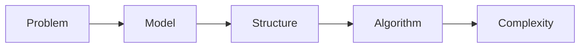

# Data Structures and Algorithms — Introduction

## Overview

Data structures and algorithms (DSA) are the vocabulary of efficient programs: how we store information and the procedures we use to transform it under time and space constraints. This section connects theory to patterns you will reuse in interviews and production systems.

## Why This Exists

Every non-trivial program picks a representation (arrays, trees, graphs) and a strategy (two pointers, BFS, DP). Naming these patterns accelerates debugging, complexity analysis, and communication with peers.

## How It Works

Study progresses from linear structures ([Arrays](arrays.md), [Strings](strings.md), [Linked lists](linked_lists.md)) to constrained access ([Stacks and queues](stacks_queues.md)), hierarchical data ([Trees](trees.md)), relational models ([Graphs](graphs.md)), and optimization over choices ([Dynamic programming](dynamic_programming.md)).

## Architecture

Placeholder diagram for a typical problem-solving pipeline:




## Key Concepts

<div class="topic-box">
<strong>Pattern recognition</strong>
Most interview problems are variations of a small set of templates. The goal is not memorizing every problem, but mapping unknown tasks to known structures and invariants.
</div>

<div class="info-box">
<strong>Complexity discipline</strong>
State <code>O(·)</code> time and space for your approach before coding; adjust the approach if bounds fail the stated constraints.
</div>

## Code Examples

=== "Python — complexity mindset"

    ```python
    def sum_first_n(nums: list[int], n: int) -> int:
        """O(n) time if n ~ len(nums); O(1) extra space."""
        total = 0
        for i in range(min(n, len(nums))):
            total += nums[i]
        return total
    ```

=== "Pseudocode — invariant sketch"

    ```text
    function two_pointer_sorted(arr):
      left = 0, right = len(arr) - 1
      while left < right:
        if arr[left] + arr[right] == target: return (left, right)
        elif sum too small: left += 1
        else: right -= 1
    ```

## Interview Questions

??? question "How do you choose between a hash map and a tree-based map?"

    Prefer hash maps when you need expected O(1) lookups and either have a good hash for keys or can tolerate rare worst-case behavior. Prefer balanced trees when you need ordered traversal, range queries, or deterministic worst-case performance.

??? question "What is amortized analysis and where does it show up?"

    Amortized analysis averages the cost of a sequence of operations. Classic examples include dynamic array resizing and disjoint-set union optimizations.

## Practice Problems

- Arrays: two-sum variants, sliding window maximum, trapping rain water  
- Graphs: number of islands, course schedule (cycle detection)  
- DP: longest increasing subsequence, coin change, edit distance  

## Resources

- [CLRS](https://mitpress.mit.edu/9780262046305/introduction-to-algorithms/) — canonical algorithms reference  
- [VisuAlgo](https://visualgo.net/en) — interactive visualizations  
- [LeetCode](https://leetcode.com/) — timed practice with discussion threads  
