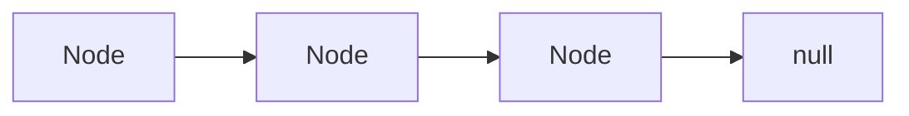

# Linked Lists

## Overview

Linked lists chain nodes with pointers. They shine when you need O(1) insertion at a known position and can tolerate O(n) random access or cache-friendly sequential scans on arrays.

## Why This Exists

Pointer manipulation is a standard interview screen for careful reasoning about edge cases: empty lists, single nodes, and cycles.

## How It Works

Master **dummy node** patterns, **fast/slow pointers** for cycle detection and midpoint splits, and **list reversal** iteratively and recursively.

## Architecture




## Key Concepts

<div class="topic-box">
<strong>Cycle detection</strong>
Floyd’s algorithm uses two pointers advancing at different speeds; if they meet, a cycle exists.
</div>

## Code Examples

=== "Python — singly linked list node"

    ```python
    class ListNode:
        def __init__(self, val: int = 0, next: "ListNode | None" = None):
            self.val = val
            self.next = next
    ```

=== "Python — reverse linked list (iterative)"

    ```python
    def reverse_list(head: ListNode | None) -> ListNode | None:
        prev = None
        cur = head
        while cur:
            nxt = cur.next
            cur.next = prev
            prev = cur
            cur = nxt
        return prev
    ```

## Interview Questions

??? question "Merge two sorted linked lists."

    Walk both pointers, always choosing the smaller head; handle empty lists and tail appends.

??? question "Detect a cycle and return the start node."

    After fast/slow meet, move one pointer to head and advance both one step at a time; the meeting point is the start.

## Practice Problems

- LeetCode 21 — Merge Two Sorted Lists  
- LeetCode 141 — Linked List Cycle  
- LeetCode 146 — LRU Cache (often implemented with doubly linked list + map)  

## Resources

- [Stanford Linked List Basics](https://cslibrary.stanford.edu/103/LinkedListBasics.pdf) — classic handout  
- [VisuAlgo — Linked List](https://visualgo.net/en/list)  
