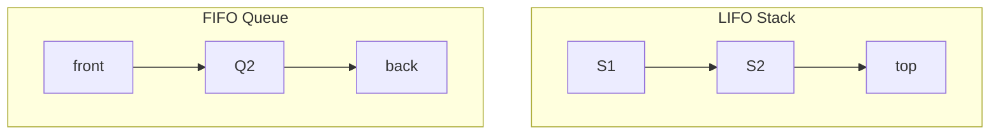

# Stacks and Queues

## Overview

Stacks are **LIFO** structures; queues are **FIFO**. Both appear as explicit data structures and as implicit patterns in recursion, breadth-first search, and scheduling.

## Why This Exists

Many algorithms reduce to “what do we process next?” Stacks model depth-first and nested structure; queues model level-order expansion and fair ordering.

## How It Works

Implementations use arrays (with resizing) or linked lists. **Monotonic stacks** solve next-greater-element problems; **deque** supports efficient push/pop on both ends.

## Architecture




## Key Concepts

<div class="info-box">
<strong>BFS uses a queue</strong>
Layer-by-layer traversal in trees and graphs typically uses a queue; DFS uses an explicit stack or the call stack.
</div>

## Code Examples

=== "Python — valid parentheses"

    ```python
    def is_valid(s: str) -> bool:
        stack: list[str] = []
        pairs = {")": "(", "}": "{", "]": "["}
        for ch in s:
            if ch in pairs:
                if not stack or stack.pop() != pairs[ch]:
                    return False
            else:
                stack.append(ch)
        return not stack
    ```

=== "Python — BFS tree level order"

    ```python
    from collections import deque

    def level_order(root):
        if not root:
            return []
        out, q = [], deque([root])
        while q:
            node = q.popleft()
            out.append(node.val)
            if node.left:
                q.append(node.left)
            if node.right:
                q.append(node.right)
        return out
    ```

## Interview Questions

??? question "Implement a queue using two stacks."

    Use one stack for enqueue and pop from the other stack when needed; amortized O(1) operations.

??? question "What is a monotonic stack used for?"

    Maintaining increasing/decreasing order to answer “next greater element” style queries in linear time.

## Practice Problems

- LeetCode 20 — Valid Parentheses  
- LeetCode 739 — Daily Temperatures (monotonic stack)  
- LeetCode 622 — Design Circular Queue  

## Resources

- [CP-Algorithms — Stack & Queue](https://cp-algorithms.com/data_structures/stack_queue_modification.html)  
- [USACO — stacks and queues](https://usaco.guide/bronze/intro-data-structures?lang=py)  
