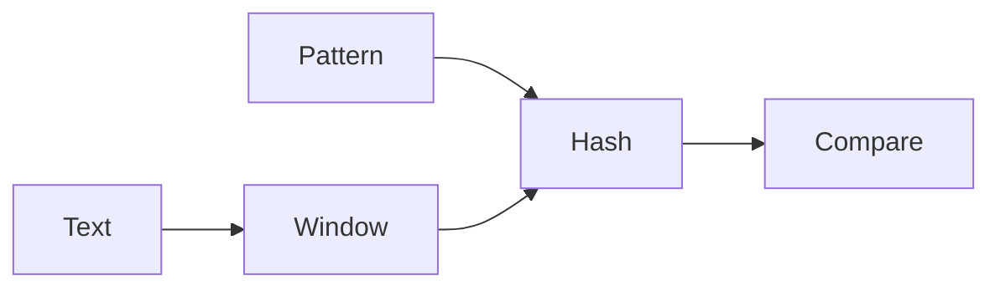

# Strings

## Overview

Strings are sequences of characters. In many languages they are immutable; algorithms often convert to lists of characters for in-place edits or use rolling hashes for fast substring comparison.

## Why This Exists

Text processing powers parsers, search, bioinformatics sketches, and security-sensitive comparisons. String problems test careful indexing and awareness of encoding/locale quirks.

## How It Works

Key ideas include **two pointers**, **rolling hash (Rabin–Karp)**, **tries** for prefix sets, and **KMP** for linear pattern matching. For interviews, KMP is less common than hashing and two-pointer approaches.

## Architecture




## Key Concepts

<div class="warning-box">
<strong>Immutability</strong>
In Python, Java, and many managed languages, naive concatenation in loops can be O(n²). Use lists or builders to accumulate.
</div>

## Code Examples

=== "Python — anagram check with counts"

    ```python
    from collections import Counter

    def is_anagram(a: str, b: str) -> bool:
        return Counter(a) == Counter(b)
    ```

=== "Python — reverse words in-place list"

    ```python
    def reverse_words(chars: list[str]) -> None:
        def rev(i: int, j: int) -> None:
            while i < j:
                chars[i], chars[j] = chars[j], chars[i]
                i += 1
                j -= 1

        rev(0, len(chars) - 1)
        start = 0
        for i in range(len(chars) + 1):
            if i == len(chars) or chars[i] == " ":
                rev(start, i - 1)
                start = i + 1
    ```

## Interview Questions

??? question "Implement a function to check if a string is a palindrome ignoring non-alphanumeric characters."

    Normalize with two pointers from both ends, skipping invalid characters; compare case-insensitively.

??? question "How does a rolling hash help substring search?"

    Update the hash in O(1) as the window slides, comparing hashes before full string comparison to reduce work.

## Practice Problems

- LeetCode 125 — Valid Palindrome  
- LeetCode 3 — Longest Substring Without Repeating Characters  
- LeetCode 76 — Minimum Window Substring  

## Resources

- [Algorithms on Strings (Maxime Crochemore)](https://www.amazon.com/Algorithms-Strings-M-Crochemore/dp/0521848992) — advanced reference  
- [CP-Algorithms — String hashing](https://cp-algorithms.com/string/string-hashing.html)  
