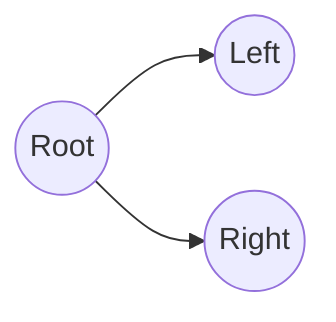

# Trees

## Overview

Trees generalize linked lists into hierarchical structure: a root, children, and parent pointers. Binary trees and binary search trees (BSTs) are interview staples; balanced search trees back many standard library collections.

## Why This Exists

Hierarchical data models filesystems, DOMs, organizational charts, and decision paths. Tree traversals are the foundation for many graph algorithms on restricted topologies.

## How It Works

Know **preorder, inorder, postorder** traversal (recursive and iterative), **BST** invariants, **height vs depth**, and **balanced tree** concepts (AVL, red-black at high level). For coding, practice **lowest common ancestor**, **serialize/deserialize**, and **diameter**.

## Architecture




## Key Concepts

<div class="topic-box">
<strong>BST property</strong>
Inorder traversal of a BST yields sorted keys—useful for validation and kth smallest queries with augmentation.
</div>

## Code Examples

=== "Python — TreeNode"

    ```python
    class TreeNode:
        def __init__(self, val: int = 0, left: "TreeNode | None" = None, right: "TreeNode | None" = None):
            self.val = val
            self.left = left
            self.right = right
    ```

=== "Python — max depth"

    ```python
    def max_depth(root: TreeNode | None) -> int:
        if not root:
            return 0
        return 1 + max(max_depth(root.left), max_depth(root.right))
    ```

## Interview Questions

??? question "Validate a binary search tree."

    Propagate valid ranges per node or track inorder predecessor; watch for integer overflow on edge values.

??? question "Serialize and deserialize a binary tree."

    Use preorder with null markers, or BFS with level-wise encoding; ensure round-trip correctness.

## Practice Problems

- LeetCode 98 — Validate Binary Search Tree  
- LeetCode 230 — Kth Smallest Element in a BST  
- LeetCode 124 — Binary Tree Maximum Path Sum  

## Resources

- [Open Data Structures — Binary Trees](https://opendatastructures.org/ods-python/6_Binary_Trees.html)  
- [LeetCode Explore — Binary Tree](https://leetcode.com/explore/learn/card/data-structure-tree/)  
