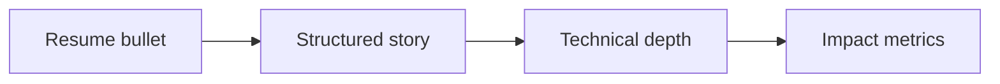

# Resume Deep Dive

## Overview

A resume deep dive prepares you to defend every line: technologies, scale, trade-offs, and your specific contributions versus the team’s. Interviewers probe until your mental model is clear.

## Why This Exists

Strong candidates articulate impact with metrics and can zoom from business outcome to architecture to debugging story without hand-waving.

## How It Works

For each project capture: **problem**, **constraints**, **your role**, **architecture diagram**, **metrics**, **failure/lesson**, **what you would improve**. Align stories with [STAR](https://en.wikipedia.org/wiki/Situation,_task,_action,_result) for behavioral follow-ups.

## Architecture




## Key Concepts

<div class="topic-box">
<strong>Claim ownership precisely</strong>
“We designed” vs “I led” vs “I contributed” matters—honesty builds trust and avoids probing collapses.
</div>

## Code Examples

=== "Text — project one-pager template"

    ```text
    Project: Payments retry service
    Context: 10k USD/day failed retries, customer churn risk
    My role: Owner for worker architecture + idempotency keys
    Stack: Go, Postgres, SQS, Datadog
    Outcome: -42% failed retries in 6 weeks; p99 latency 380ms -> 210ms
    Failure: Misconfigured DLQ visibility — postmortem + runbook
    ```

## Interview Questions

??? question "Tell me about a technical disagreement you had."

    Focus on data, user impact, and resolution—avoid blaming; show how you validated assumptions.

??? question "How do you discuss a failed project?"

    Own the outcome, describe early signals missed, concrete corrective actions, and what you monitor now.

## Practice Problems

- Write STAR stories for your top three projects  
- Draw architecture diagrams from memory in 5 minutes each  

## Resources

- [Tech Interview Handbook — resume](https://www.techinterviewhandbook.org/resume/)  
- [Levels.fyi blog](https://www.levels.fyi/blog/) — compensation context while job searching  
