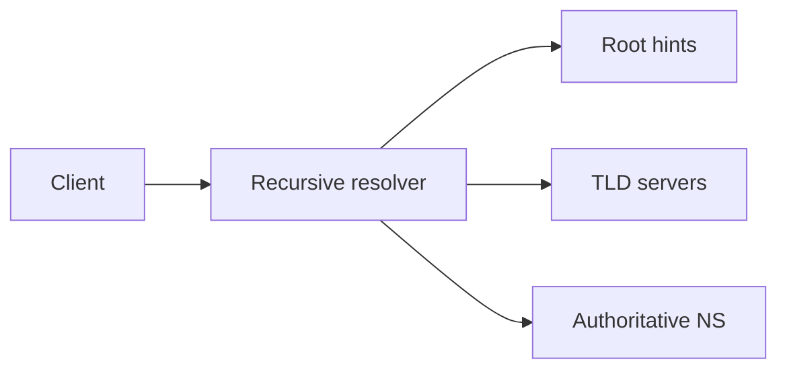

# DNS

## Overview

The Domain Name System maps names to records (A, AAAA, CNAME, MX, TXT, …) through a hierarchical, delegated namespace with caching at many layers.

## Why This Exists

Humans prefer names; networks route by addresses. DNS is also a control plane for failover, traffic steering, and validation (TXT for ACME).

## How It Works

Understand **recursive resolvers**, **authoritative servers**, **TTL**, **negative caching**, **DNSSEC** basics, and operational pain points like **propagation delay** and **NXDOMAIN** misconfigurations.

## Architecture




## Key Concepts

<div class="info-box">
<strong>Caching everywhere</strong>
Browser, OS stub resolver, ISP/Google/Cloudflare recursive resolver, and application libraries may cache differently—debugging requires knowing which layer answered.
</div>

## Code Examples

=== "bash — query records"

    ```bash
    dig +trace example.com
    dig AAAA api.example.com @1.1.1.1
    ```

## Interview Questions

??? question "What is the difference between CNAME and A records?"

    A/AAAA point a name to addresses; CNAME aliases one name to another canonical name (with restrictions at zone apex).

??? question "Why might DNS cause intermittent failures?"

    Stale TTLs, partial delegation updates, resolver hijacking, or rate limiting under bursts.

## Practice Problems

- Plan a blue/green DNS cutover with minimal downtime  
- Explain how split-horizon DNS works for private networks  

## Resources

- [DNSimple — DNS guides](https://support.dnsimple.com/)  
- [Google — how DNS works](https://howdns.works/)  
