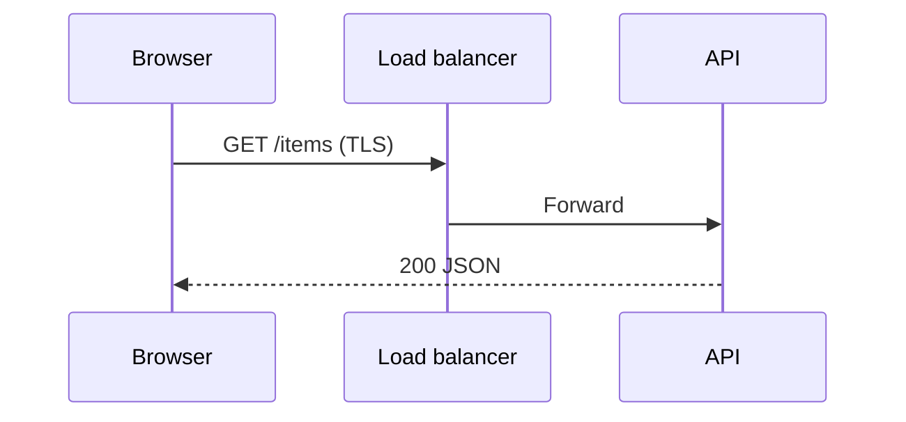

# HTTP and HTTPS

## Overview

**HTTP** is an application protocol for resources identified by URLs, with methods, headers, and bodies. **HTTPS** wraps HTTP in **TLS** for confidentiality and integrity on the wire.

## Why This Exists

The web runs on HTTP semantics; APIs reuse the same verbs and caching primitives. Understanding status codes, headers, and versions prevents subtle production bugs.

## How It Works

Study **methods** (GET, POST, PUT, PATCH, DELETE), **idempotency**, **status codes**, **caching** (`Cache-Control`, `ETag`), **cookies**, **CORS**, and versions **HTTP/1.1**, **HTTP/2** (multiplexing), **HTTP/3** (QUIC).

## Architecture




## Key Concepts

<div class="topic-box">
<strong>Statelessness</strong>
Each HTTP request should carry enough context (headers, cookies, tokens) for the server to handle it; sessions live in stores or tokens.
</div>

## Code Examples

=== "HTTP/1.1 — raw request shape"

    ```http
    GET /v1/users/me HTTP/1.1
    Host: api.example.com
    Authorization: Bearer <token>
    Accept: application/json
    ```

=== "curl — verbose TLS"

    ```bash
    curl -v https://api.example.com/v1/health
    ```

## Interview Questions

??? question "What is the difference between PUT and PATCH?"

    PUT often replaces a resource; PATCH applies partial updates—exact semantics depend on API design and idempotency expectations.

??? question "How does TLS relate to HTTPS?"

    TLS negotiates keys, authenticates the server (and optionally client), then encrypts HTTP messages.

## Practice Problems

- Design caching headers for a versioned static asset vs personalized HTML  
- Explain CORS preflight and which requests trigger it  

## Resources

- [MDN — HTTP](https://developer.mozilla.org/en-US/docs/Web/HTTP)  
- [RFC 9110 — HTTP semantics](https://www.rfc-editor.org/rfc/rfc9110.html)  
