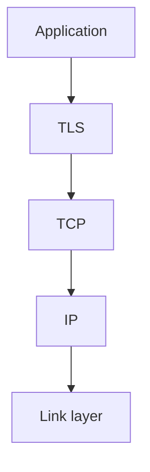

# Networking — Introduction

## Overview

Networking describes how machines address, route, and deliver data across links and the global internet. This section builds intuition from physical links to application protocols your services depend on.

## Why This Exists

Backend engineers debug timeouts, TLS failures, DNS flaps, and load balancer behavior. Clear mental models reduce guesswork when production incidents strike.

## How It Works

Progress through layering ([OSI model](osi_model.md)), transport ([TCP and UDP](tcp_udp.md)), application protocols ([HTTP and HTTPS](http_https.md)), naming ([DNS](dns.md)), traffic distribution ([Load balancing](load_balancing.md)), and edge delivery ([CDN](cdn.md)).

## Architecture




## Key Concepts

<div class="topic-box">
<strong>End-to-end principle</strong>
Intelligence often lives at endpoints; the network tries to deliver datagrams best-effort while higher layers add reliability and security.
</div>

## Code Examples

=== "bash — inspect TLS certificate"

    ```bash
    curl -Iv https://example.com 2>&1 | sed -n '1,20p'
    ```

## Interview Questions

??? question "Why is TCP considered reliable and UDP not?"

    TCP provides acknowledgments, retransmissions, ordering, and congestion control; UDP exposes minimal datagram delivery without those guarantees.

??? question "What problem does DNS solve?"

    Human-readable names to IP addresses with caching, delegation, and distributed authority.

## Practice Problems

- Trace a browser request through DNS, TCP handshake, TLS, and HTTP  
- Compare latency when bypassing CDN vs edge cache hit  

## Resources

- [Computer Networking: A Top-Down Approach](https://gaia.cs.umass.edu/kurose_ross/) — textbook  
- [MDN — HTTP overview](https://developer.mozilla.org/en-US/docs/Web/HTTP/Overview)  
