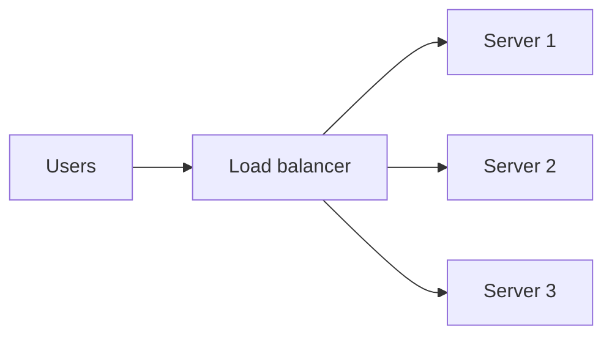

# Load Balancing

## Overview

Load balancers distribute traffic across backends to improve utilization, availability, and scalability. They may operate at layer 4 (connections) or layer 7 (HTTP-aware routing).

## Why This Exists

Single servers fail and saturate; load balancing spreads work and enables health checks, TLS termination, and canary routing.

## How It Works

Algorithms: **round robin**, **least connections**, **weighted**, **consistent hashing** for cache affinity. Features: **health checks**, **session stickiness**, **TLS termination**, **rate limiting**, **WAF** integration.

## Architecture




## Key Concepts

<div class="warning-box">
<strong>Health checks must match reality</strong>
Shallow TCP checks can mark unhealthy nodes as healthy; deep checks should validate application readiness without overloading dependencies.
</div>

## Code Examples

=== "YAML — conceptual k8s Service (ClusterIP vs Ingress)"

    ```yaml
    apiVersion: v1
    kind: Service
    metadata:
      name: api
    spec:
      selector:
        app: api
      ports:
        - port: 80
          targetPort: 8080
    ```

## Interview Questions

??? question "What is connection draining?"

    Stop sending new connections to a backend while allowing existing connections to finish before removal—important for graceful deploys.

??? question "When does consistent hashing help?"

    When you want minimal key remapping as nodes join/leave—common for caches and stateful partitions.

## Practice Problems

- Compare L4 vs L7 load balancing for a WebSocket service  
- Design health checks for a service that depends on a flaky database  

## Resources

- [NGINX load balancing guide](https://docs.nginx.com/nginx/admin-guide/load-balancer/http-load-balancer/)  
- [AWS ELB concepts](https://docs.aws.amazon.com/elasticloadbalancing/latest/userguide/introduction.html)  
