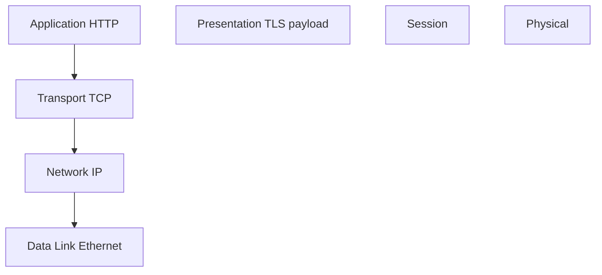

# OSI Model

## Overview

The OSI model partitions network communication into seven layers from physical bits to application semantics. Modern stacks often teach the **TCP/IP** model, but OSI terminology still appears in interviews and documentation.

## Why This Exists

Layered models separate concerns: cabling vs framing vs routing vs sessions vs applications. They help localize failures (“is it layer 4 or layer 7?”).

## How It Works

Layers (bottom-up): **Physical**, **Data Link**, **Network**, **Transport**, **Session**, **Presentation**, **Application**. Map real protocols: Ethernet/Wi-Fi (1–2), IP (3), TCP/UDP (4), TLS (5–6-ish), HTTP (7).

## Architecture




## Key Concepts

<div class="info-box">
<strong>Not a law of physics</strong>
Real systems blur boundaries—TLS spans what OSI would split across layers; use the model to communicate, not to force reality into boxes.
</div>

## Code Examples

=== "Text — mapping a HTTPS call"

    ```text
    HTTP message -> TLS record -> TCP segment -> IP packet -> Ethernet frame
    ```

## Interview Questions

??? question "Where does a router operate vs a switch?"

    Routers forward based on IP (layer 3); switches typically forward frames by MAC (layer 2); modern devices blur lines with L3 switches.

??? question "Why do people say load balancers can be L4 or L7?"

    L4 balances TCP/UDP flows with little protocol awareness; L7 understands HTTP headers, cookies, and routing rules.

## Practice Problems

- Label each hop in a traceroute with the closest OSI layer  
- Explain where fragmentation and reassembly occur in IP vs TCP  

## Resources

- [Cloudflare — OSI model](https://www.cloudflare.com/learning/ddos/glossary/open-systems-interconnection-model-osi/)  
- [RFC 1122 — host requirements](https://www.rfc-editor.org/rfc/rfc1122) — practical layering discussion  
