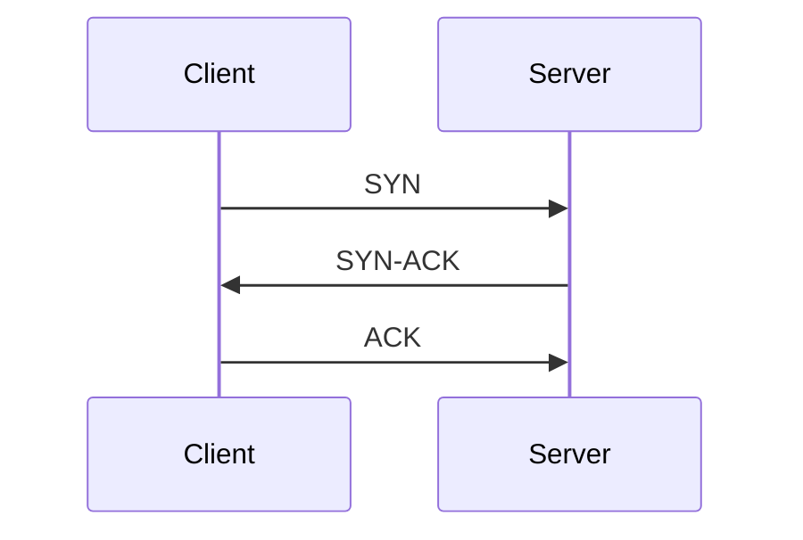

# TCP and UDP

## Overview

**TCP** provides reliable, ordered byte streams with congestion control. **UDP** provides connectionless datagrams with minimal overhead—ideal for latency-sensitive or broadcast-style workloads where the app handles loss.

## Why This Exists

Different applications need different trade-offs between latency, throughput, ordering, and overhead. Transport protocols encode those trade-offs.

## How It Works

TCP: **three-way handshake**, **sequence numbers**, **ACKs**, **retransmissions**, **flow control** (windowing), **congestion control** (Cubic, BBR). UDP: send and forget; optionally pair with app-level reliability (QUIC builds on UDP with modern features).

## Architecture




## Key Concepts

<div class="warning-box">
<strong>Head-of-line blocking</strong>
TCP’s ordered delivery can delay later bytes if an early segment is lost—HTTP/3/QUIC mitigates at application scope with separate streams.
</div>

## Code Examples

=== "Python — TCP echo (conceptual)"

    ```python
    import socket

    def run_echo_server(host: str = "127.0.0.1", port: int = 9000) -> None:
        with socket.socket(socket.AF_INET, socket.SOCK_STREAM) as s:
            s.setsockopt(socket.SOL_SOCKET, socket.SO_REUSEADDR, 1)
            s.bind((host, port))
            s.listen()
            conn, _ = s.accept()
            with conn:
                data = conn.recv(4096)
                conn.sendall(data)
    ```

## Interview Questions

??? question "When would you choose UDP?"

    Real-time media with app-tolerated loss, DNS (traditionally), gaming, or when building custom reliability like QUIC.

??? question "What is TIME_WAIT in TCP?"

    A state ensuring stray segments drain after close; can exhaust ephemeral ports under churn—tune kernel settings carefully on high-QPS clients.

## Practice Problems

- Compare behavior under packet loss for a TCP download vs a UDP video stream  
- Explain how BBR differs from loss-based congestion control at a high level  

## Resources

- [High Performance Browser Networking — TCP](https://hpbn.co/tcp/)  
- [RFC 9293 — TCP](https://www.rfc-editor.org/rfc/rfc9293.html)  
