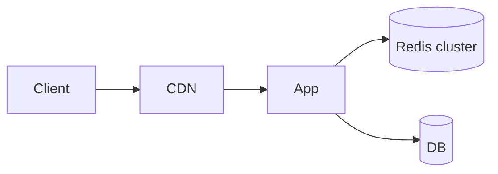

# Caching (System Design)

## Overview

At scale, caching is often the difference between a responsive system and a database bottleneck. System design asks where caches live, how they invalidate, and what consistency users observe.

## Why This Exists

Repeated reads dominate many workloads; moving hot data closer to users reduces latency and cost.

## How It Works

Layers: **browser**, **CDN**, **reverse proxy**, **application**, **distributed cache**, **database buffer pool**. Patterns: **cache-aside**, **read/write-through**, **write-behind**. Pitfalls: **staleness**, **thundering herds**, **invalidation storms**.

## Architecture




## Key Concepts

<div class="topic-box">
<strong>Consistency contract</strong>
Document whether users can read stale data and for how long; drive TTL and invalidation from product requirements.
</div>

## Code Examples

=== "Text — invalidation strategy"

    ```text
    - Time-based TTL for low-risk data
    - Event-driven invalidation on writes for critical entities
    - Versioned keys for immutable snapshots
    ```

## Interview Questions

??? question "How do CDNs interact with authenticated APIs?"

    Usually only public assets cache at edge; private APIs use short TTLs, signed URLs, or no CDN caching—validate per route.

??? question "What is a cache coherency problem?"

    Multiple caches hold inconsistent copies of the same entity—mitigate with TTL, pub/sub invalidation, or single writer paths.

## Practice Problems

- Cache a user profile that updates frequently vs a static catalog  
- Design a leaderboard with Redis sorted sets and periodic snapshots  

## Resources

- [Caching at scale (Facebook/Meta engineering talks)](https://engineering.fb.com/)  
- [Redis persistence and replication](https://redis.io/docs/management/persistence/)  
