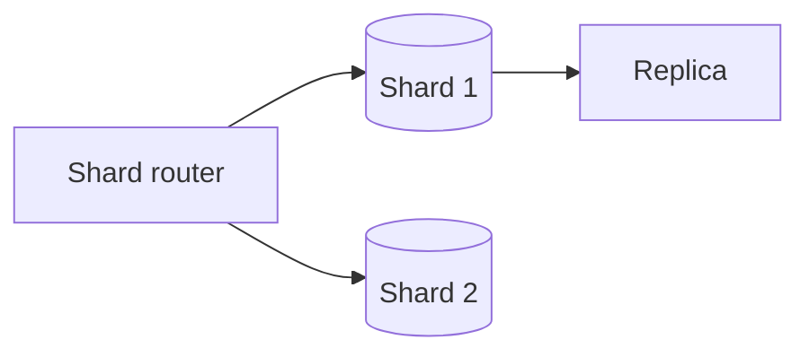

# Database Scaling

## Overview

Database scaling tackles read/write growth beyond single-node limits through replication, partitioning, specialized engines, and application-level patterns.

## Why This Exists

The database is often the hardest component to scale; its data model and consistency constraints ripple through the whole architecture.

## How It Works

**Read scaling**: replicas, caching, CQRS. **Write scaling**: sharding, partitioning keys, avoiding hot partitions. **Operational**: backups, failover, online schema changes. Align with [Databases — scaling](../databases/scaling_databases.md).

## Architecture




## Key Concepts

<div class="topic-box">
<strong>Choose the shard key wisely</strong>
Skewed keys undo horizontal scaling; measure distribution and rebalance with operational tooling.
</div>

## Code Examples

=== "SQL — tenant-aware routing (conceptual)"

    ```sql
    -- Prefer tenant_id in every query for partition pruning
    SELECT * FROM orders WHERE tenant_id = $1 AND id = $2;
    ```

## Interview Questions

??? question "What is the difference between replication and sharding?"

    Replication copies the same dataset for availability and read scale; sharding splits different subsets of data across nodes.

??? question "How does two-phase commit relate to scaling?"

    2PC coordinates distributed transactions but increases latency and failure modes—often avoided in favor of sagas and idempotent steps.

## Practice Problems

- Shard a multi-tenant messaging system by conversation id  
- Evaluate CQRS for a read-heavy analytics dashboard  

## Resources

- [Designing Data-Intensive Applications](https://dataintensive.net/)  
- [Google Spanner paper](https://research.google/pubs/pub39966/) — global SQL at scale  
