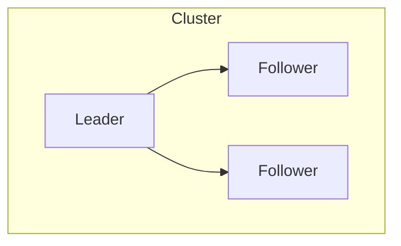

# Distributed Systems

## Overview

Distributed systems coordinate independent nodes over unreliable networks. Core concepts include clocks, failure models, consensus, replication, and consistency trade-offs.

## Why This Exists

Large-scale systems are always distributed; understanding limitations prevents impossible designs and explains real-world behavior.

## How It Works

Topics: **CAP** as a teaching lens (not a literal binary), **linearizability**, **serializability**, **eventual consistency**, **vector clocks**, **leader election**, **Raft/Paxos** at high level, **idempotency**, **exactly-once semantics** (end-to-end), **byzantine vs crash** faults.

## Architecture




## Key Concepts

<div class="warning-box">
<strong>Networks partition</strong>
Assume messages can be delayed, duplicated, or dropped; design APIs and storage operations to be safe under retries.
</div>

## Code Examples

=== "Text — idempotent operations"

    ```text
    PUT /items/{id} with full state is naturally idempotent
    POST /charges with Idempotency-Key header dedupes on server
    ```

## Interview Questions

??? question "What is the two generals problem?"

    Impossibility of guaranteed agreement over unreliable communication—motivates why protocols use timeouts and probabilistic guarantees.

??? question "Explain split-brain and mitigation."

    Multiple nodes believe they are primary; mitigate with quorum (majority), fencing tokens, and careful failover automation.

## Practice Problems

- Compare strong consistency in a single-region DB vs cross-region replication  
- Design a distributed lock with lease expiration and fencing  

## Resources

- [Distributed Systems (Kleppmann)](https://dataintensive.net/)  
- [Raft paper](https://raft.github.io/raft.pdf)  
