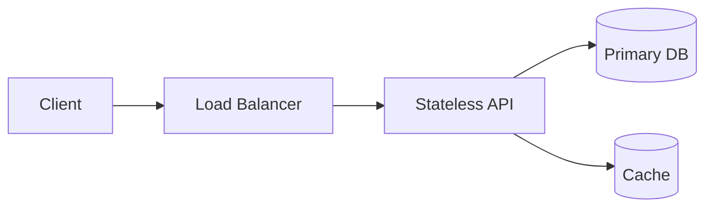

# System Design — Fundamentals

## Overview

System design starts from requirements: functional features, scale, latency, consistency, durability, and cost. You propose components and data flows, then iterate on bottlenecks and failure modes.

## Why This Exists

Engineering organizations need shared vocabulary for trade-offs: replication vs partitioning, sync vs async, strong vs eventual consistency.

## How It Works

Clarify **users and QPS**, **read/write ratio**, **data size and growth**, **SLA/SLO**, and **compliance**. Sketch **APIs**, **data model**, **storage**, **caching**, **load balancing**, **async processing**, and **observability**.

## Architecture




## Key Concepts

<div class="topic-box">
<strong>Start simple, justify complexity</strong>
Reach for a queue, shard, or multi-region setup only when the problem and scale demand it—avoid resume-driven architecture.
</div>

## Code Examples

=== "Text — requirement checklist"

    ```text
    - Who are the users? mobile/web/internal
    - Peak QPS and payload sizes
    - Consistency: can reads lag? by how long?
    - Durability: RPO/RTO targets
    - Multi-tenant vs single-tenant isolation
    ```

## Interview Questions

??? question "How do you begin a system design interview?"

    Ask clarifying questions, define scope, enumerate core entities and operations, estimate capacity, then propose a high-level design before deep dives.

??? question "What is the difference between latency and throughput?"

    Latency is time to service a request; throughput is completed work per unit time—optimizing one can hurt the other without careful tuning.

## Practice Problems

- Design a URL shortener with analytics  
- Design a rate limiter for distributed API keys  

## Resources

- [System Design Primer](https://github.com/donnemartin/system-design-primer)  
- [ByteByteGo](https://bytebytego.com/) — visual guides  
