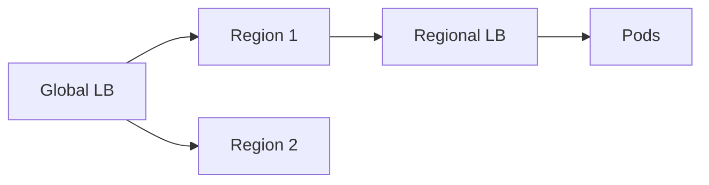

# Load Balancers (System Design)

## Overview

Load balancers distribute traffic across healthy instances to balance utilization and improve availability. They can terminate TLS, enforce routing rules, and shield origins from overload.

## Why This Exists

Single points of failure and saturation disappear when requests are spread across pools with health-aware routing.

## How It Works

Algorithms and features mirror [Networking — load balancing](../networking/load_balancing.md), but system design focuses on **session affinity**, **blue/green deployments**, **canary** routing, and **global** vs **regional** load balancing.

## Architecture




## Key Concepts

<div class="warning-box">
<strong>Sticky sessions</strong>
Pinning users can break even load during deploys; prefer stateless services with shared session stores when possible.
</div>

## Code Examples

=== "YAML — Ingress rule (illustrative)"

    ```yaml
    spec:
      rules:
        - host: api.example.com
          http:
            paths:
              - path: /
                pathType: Prefix
                backend:
                  service:
                    name: api
                    port:
                      number: 80
    ```

## Interview Questions

??? question "How do you drain connections during deploy?"

    Remove instance from rotation, wait for active connections to finish or timeout, then deploy—coordinate with health checks.

??? question "What is anycast?"

    Same IP served from multiple locations; routing uses BGP to reach nearest POP—used by global load balancing and CDNs.

## Practice Problems

- Compare active-passive vs active-active multi-region setups  
- Design failover when regional database is unavailable  

## Resources

- [AWS Elastic Load Balancing](https://docs.aws.amazon.com/elasticloadbalancing/latest/userguide/what-is-load-balancing.html)  
- [Kubernetes Ingress](https://kubernetes.io/docs/concepts/services-networking/ingress/)  
