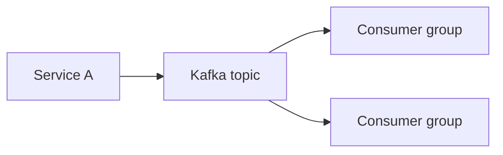

# Message Queues

## Overview

Message queues buffer work between producers and consumers, enabling asynchronous processing, load leveling, and decoupled services.

## Why This Exists

Synchronous chains amplify tail latency and failures. Queues absorb spikes and provide a retry surface for transient errors.

## How It Works

Compare **queues** (SQS, RabbitMQ) vs **logs/streams** (Kafka, Pulsar). Concepts: **ordering**, **delivery semantics**, **dead-letter queues**, **consumer groups**, **backpressure**, **schema evolution** for events.

## Architecture




## Key Concepts

<div class="info-box">
<strong>Ordering guarantees</strong>
Global ordering is expensive; partition by entity id to preserve ordering per key while parallelizing across partitions.
</div>

## Code Examples

=== "JSON — event envelope"

    ```json
    {
      "event_id": "019b2f8d-...",
      "type": "order.created",
      "occurred_at": "2026-04-13T12:00:00Z",
      "data": { "order_id": "..." }
    }
    ```

## Interview Questions

??? question "When would you pick Kafka over RabbitMQ?"

    Kafka for high-throughput event logs, replay, and stream processing; RabbitMQ for flexible routing and task queues—depends on workload.

??? question "What is consumer lag?"

    The difference between produced and processed offsets—monitor SLOs on lag to detect slow consumers.

## Practice Problems

- Design an outbox pattern for reliable publishing from DB transactions  
- Handle poison messages in a payment processing consumer  

## Resources

- [Kafka documentation](https://kafka.apache.org/documentation/)  
- [Enterprise Integration Patterns](https://www.enterpriseintegrationpatterns.com/)  
