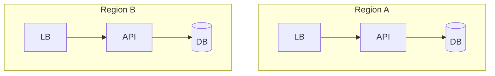

# Scalability

## Overview

Scalability is the ability to handle growth—more users, data, and regions—without proportional loss of performance or reliability. It spans **vertical** (bigger machines) and **horizontal** (more machines).

## Why This Exists

Products rarely fail from lack of features alone; they fail from outages, cost explosions, or latency regressions under load.

## How It Works

Dimensions: **scale up/out**, **partitioning**, **replication**, **caching**, **stateless tiers**, **rate limiting**, **autoscaling**, **multi-region** strategies. Watch **hotspots** and **coordination overhead**.

## Architecture




## Key Concepts

<div class="info-box">
<strong>Utilization targets</strong>
Run production with headroom; auto-scaling should react before SLO breaches—validate with load tests and chaos experiments.
</div>

## Code Examples

=== "Text — back-of-envelope"

    ```text
    1M DAU, each 20 requests/day -> ~230 RPS average
    Peak ~10x average -> ~2.3k RPS; size instances accordingly
    ```

## Interview Questions

??? question "What is the difference between strong and eventual consistency?"

    Strong consistency guarantees reads reflect latest writes; eventual consistency allows temporary divergence across replicas.

??? question "Name a coordination service bottleneck."

    A single global counter or lock can serialize traffic—shard or approximate (e.g., HLL for counts).

## Practice Problems

- Scale a social feed with fan-out on write vs read  
- Identify bottlenecks in a monolithic checkout service during peak sales  

## Resources

- [Scalability Rules (Abbott & Fisher)](https://akfpartners.com/books/)  
- [AWS Architecture Center](https://aws.amazon.com/architecture/)  
